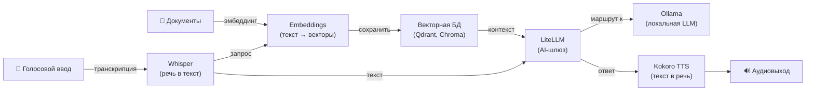

[English](README.md) | [简体中文](README-zh.md) | [繁體中文](README-zh-Hant.md) | [Русский](README-ru.md)

# API текстовых эмбеддингов на Docker

[](https://github.com/hwdsl2/docker-embeddings/actions/workflows/main.yml) &nbsp;[](https://opensource.org/licenses/MIT)

Docker-образ для запуска самостоятельно размещённого сервера текстовых эмбеддингов на базе [Hugging Face Text Embeddings Inference (TEI)](https://github.com/huggingface/text-embeddings-inference). Предоставляет совместимый с OpenAI API `/v1/embeddings`. Простой, приватный, для самостоятельного развёртывания.

**Возможности:**

- Совместимый с OpenAI эндпоинт `POST /v1/embeddings` — любое приложение, использующее OpenAI Embeddings API, переключается с изменением одной строки
- На базе [Hugging Face TEI](https://github.com/huggingface/text-embeddings-inference) — высокопроизводительного сервера эмбеддингов на Rust
- Поддержка популярных моделей: `BAAI/bge-small-en-v1.5`, `BAAI/bge-m3`, `nomic-embed-text-v1.5` и других
- Управление моделями через вспомогательный скрипт (`embed_manage`)
- Текстовые данные остаются на вашем сервере — никакие данные не отправляются третьим сторонам
- Офлайн-режим — работа без доступа к интернету с предварительно кэшированными моделями (`EMBED_LOCAL_ONLY`)
- Автоматически собирается и публикуется через [GitHub Actions](https://github.com/hwdsl2/docker-embeddings/actions/workflows/main.yml)
- Постоянный кэш моделей через Docker-том
- Поддерживаемая платформа: `linux/amd64`

**Также доступно:**

- ИИ/Аудио: [Whisper (STT)](https://github.com/hwdsl2/docker-whisper/blob/main/README-ru.md), [Kokoro (TTS)](https://github.com/hwdsl2/docker-kokoro/blob/main/README-ru.md), [LiteLLM](https://github.com/hwdsl2/docker-litellm/blob/main/README-ru.md), [Ollama (LLM)](https://github.com/hwdsl2/docker-ollama/blob/main/README-ru.md)
- VPN: [WireGuard](https://github.com/hwdsl2/docker-wireguard/blob/main/README-ru.md), [OpenVPN](https://github.com/hwdsl2/docker-openvpn/blob/main/README-ru.md), [IPsec VPN](https://github.com/hwdsl2/docker-ipsec-vpn-server/blob/master/README-ru.md), [Headscale](https://github.com/hwdsl2/docker-headscale/blob/main/README-ru.md)
- Инструменты: [MCP Gateway](https://github.com/hwdsl2/docker-mcp-gateway/blob/main/README-ru.md)

**Совет:** Whisper, Kokoro, Embeddings, LiteLLM, Ollama и MCP-шлюз можно [использовать совместно](#использование-с-другими-ai-сервисами) для построения полного приватного AI-стека на собственном сервере.

## Быстрый старт

Запустите сервер текстовых эмбеддингов следующей командой:

```bash
docker run \
    --name embeddings \
    --restart=always \
    -v embeddings-data:/var/lib/embeddings \
    -p 8000:8000 \
    -d hwdsl2/embeddings-server
```

**Примечание:** Для развёртываний, доступных из интернета, **настоятельно рекомендуется** добавить HTTPS с помощью [обратного прокси](#использование-обратного-прокси). В этом случае также замените `-p 8000:8000` на `-p 127.0.0.1:8000:8000` в команде `docker run` выше, чтобы исключить прямой доступ к незашифрованному порту извне. Установите `EMBED_API_KEY` в файле `env`, когда сервер доступен из публичного интернета.

При первом запуске модель по умолчанию `BAAI/bge-small-en-v1.5` (~130 МБ) автоматически загружается и кэшируется. Проверьте логи, чтобы убедиться в готовности сервера:

```bash
docker logs embeddings
```

После появления сообщения "Text embeddings server is ready" сгенерируйте первые эмбеддинги:

```bash
curl http://IP_вашего_сервера:8000/v1/embeddings \
    -H "Content-Type: application/json" \
    -d '{"input": "The quick brown fox", "model": "text-embedding-ada-002"}'
```

**Ответ:**
```json
{"object":"list","data":[{"object":"embedding","embedding":[0.032,...,-0.017],"index":0}],"model":"BAAI/bge-small-en-v1.5","usage":{"prompt_tokens":5,"total_tokens":5}}
```

## Требования

- Linux-сервер (локальный или облачный) с установленным Docker
- Поддерживаемая архитектура: `amd64` (x86_64)
- Минимальный объём оперативной памяти: ~250 МБ для модели по умолчанию `BAAI/bge-small-en-v1.5` (см. [таблицу моделей](#смена-модели))
- Доступ к интернету для первоначальной загрузки модели (после загрузки модель кэшируется локально). Не требуется при использовании `EMBED_LOCAL_ONLY=true` с предварительно кэшированными моделями.

Для развёртываний, доступных из интернета, см. [Использование обратного прокси](#использование-обратного-прокси) для добавления HTTPS.

## Загрузка

Получите надёжную сборку из [реестра Docker Hub](https://hub.docker.com/r/hwdsl2/embeddings-server/):

```bash
docker pull hwdsl2/embeddings-server
```

Также можно загрузить с [Quay.io](https://quay.io/repository/hwdsl2/embeddings-server):

```bash
docker pull quay.io/hwdsl2/embeddings-server
docker image tag quay.io/hwdsl2/embeddings-server hwdsl2/embeddings-server
```

Поддерживаемая платформа: `linux/amd64`.

## Переменные окружения

Все переменные являются необязательными. Если они не заданы, автоматически применяются безопасные значения по умолчанию.

Данный Docker-образ использует следующие переменные, которые можно задать в файле `env` (см. [пример](embed.env.example)):

| Переменная | Описание | По умолчанию |
|---|---|---|
| `EMBED_MODEL` | ID модели HuggingFace для генерации эмбеддингов. См. [таблицу моделей](#смена-модели). | `BAAI/bge-small-en-v1.5` |
| `EMBED_PORT` | HTTP-порт для API (1–65535). | `8000` |
| `EMBED_API_KEY` | Опциональный Bearer-токен. Если задан, все запросы должны содержать `Authorization: Bearer <key>`. | *(не задан)* |
| `EMBED_HF_TOKEN` | Токен HuggingFace Hub для доступа к приватным или ограниченным моделям. Не требуется для публичных моделей. | *(не задан)* |
| `EMBED_LOCAL_ONLY` | При установке любого непустого значения (например, `true`) отключает все загрузки моделей с HuggingFace. Для офлайн- или изолированных развёртываний с предварительно кэшированными моделями. | *(не задан)* |

**Примечание:** В файле `env` значения можно заключать в одинарные кавычки, например `VAR='value'`. Не используйте пробелы вокруг `=`. При изменении `EMBED_PORT` обновите флаг `-p` в команде `docker run` соответствующим образом.

Пример использования файла `env`:

```bash
cp embed.env.example embed.env
# Отредактируйте embed.env, задав нужные параметры, затем:
docker run \
    --name embeddings \
    --restart=always \
    -v embeddings-data:/var/lib/embeddings \
    -v ./embed.env:/embed.env:ro \
    -p 8000:8000 \
    -d hwdsl2/embeddings-server
```

Файл `env` монтируется в контейнер и применяется при каждом перезапуске без необходимости пересоздавать контейнер.

<details>
<summary>Также можно передать его через <code>--env-file</code></summary>

```bash
docker run \
    --name embeddings \
    --restart=always \
    -v embeddings-data:/var/lib/embeddings \
    -p 8000:8000 \
    --env-file=embed.env \
    -d hwdsl2/embeddings-server
```

</details>

## Использование docker-compose

```bash
cp embed.env.example embed.env
# Отредактируйте embed.env при необходимости, затем:
docker compose up -d
docker logs embeddings
```

Пример `docker-compose.yml` (уже включён в проект):

```yaml
services:
  embeddings:
    image: hwdsl2/embeddings-server
    container_name: embeddings
    restart: always
    ports:
      - "8000:8000/tcp"  # Для хост-обратного прокси замените на "127.0.0.1:8000:8000/tcp"
    volumes:
      - embeddings-data:/var/lib/embeddings
      - ./embed.env:/embed.env:ro

volumes:
  embeddings-data:
```

**Примечание:** Для развёртываний, доступных из интернета, настоятельно рекомендуется добавить HTTPS с помощью [обратного прокси](#использование-обратного-прокси). В этом случае замените `"8000:8000/tcp"` на `"127.0.0.1:8000:8000/tcp"` в `docker-compose.yml`, чтобы исключить прямой доступ к незашифрованному порту. Установите `EMBED_API_KEY` в файле `env`, когда сервер доступен из публичного интернета.

## Справочник по API

API совместим с [эндпоинтом эмбеддингов OpenAI](https://platform.openai.com/docs/api-reference/embeddings). Любое приложение, уже вызывающее `https://api.openai.com/v1/embeddings`, может переключиться на самостоятельный хостинг, задав:

```
OPENAI_BASE_URL=http://IP_вашего_сервера:8000
```

### Генерация эмбеддингов

```
POST /v1/embeddings
Content-Type: application/json
```

**Параметры:**

| Параметр | Тип | Обязательный | Описание |
|---|---|---|---|
| `input` | строка или массив | ✅ | Текст для преобразования в эмбеддинг. Строка — для одного текста, массив строк — для пакетной обработки. |
| `model` | строка | ✅ | Передайте любую строку (например, `text-embedding-ada-002`). Значение принимается для совместимости с API; всегда используется активная модель, заданная в `EMBED_MODEL`. |

**Пример — одиночный запрос:**

```bash
curl http://IP_вашего_сервера:8000/v1/embeddings \
    -H "Content-Type: application/json" \
    -d '{"input": "The quick brown fox", "model": "text-embedding-ada-002"}'
```

**Пример — пакетный запрос:**

```bash
curl http://IP_вашего_сервера:8000/v1/embeddings \
    -H "Content-Type: application/json" \
    -d '{"input": ["Первое предложение", "Второе предложение"], "model": "text-embedding-ada-002"}'
```

С аутентификацией по API-ключу:

```bash
curl http://IP_вашего_сервера:8000/v1/embeddings \
    -H "Authorization: Bearer your_api_key" \
    -H "Content-Type: application/json" \
    -d '{"input": "Ваш текст здесь", "model": "text-embedding-ada-002"}'
```

**Ответ:**

```json
{
  "object": "list",
  "data": [
    {
      "object": "embedding",
      "embedding": [0.032, -0.018, ...],
      "index": 0
    }
  ],
  "model": "BAAI/bge-small-en-v1.5",
  "usage": { "prompt_tokens": 5, "total_tokens": 5 }
}
```

### Информация о модели

```
GET /info
```

Возвращает ID активной модели, максимальную длину входного текста и версию сервера.

```bash
curl http://IP_вашего_сервера:8000/info
```

### Интерактивная документация по API

Интерактивный Swagger UI доступен по адресу:

```
http://IP_вашего_сервера:8000/docs
```

## Постоянные данные

Все данные сервера хранятся в Docker-томе (`/var/lib/embeddings` внутри контейнера):

```
/var/lib/embeddings/
├── models--BAAI--bge-small-en-v1.5/   # Кэшированные файлы модели (загружены с HuggingFace)
├── .port                # Активный порт (используется embed_manage)
├── .model               # ID активной модели (используется embed_manage)
└── .server_addr         # Кэшированный IP сервера (используется embed_manage)
```

Создайте резервную копию Docker-тома для сохранения загруженных моделей. Размер моделей — от ~90 МБ до ~1.3 ГБ; они загружаются только один раз, а сохранение тома позволяет избежать повторной загрузки при пересоздании контейнера.

## Управление сервером

Используйте `embed_manage` внутри работающего контейнера для проверки и управления сервером.

**Показать информацию о сервере:**

```bash
docker exec embeddings embed_manage --showinfo
```

**Список рекомендуемых моделей:**

```bash
docker exec embeddings embed_manage --listmodels
```

**Предварительная загрузка модели:**

```bash
docker exec embeddings embed_manage --pullmodel BAAI/bge-base-en-v1.5
```

## Смена модели

Для смены активной модели:

1. *(Необязательно, но рекомендуется)* Предварительно загрузите новую модель, пока сервер работает:
   ```bash
   docker exec embeddings embed_manage --pullmodel BAAI/bge-base-en-v1.5
   ```

2. Обновите `EMBED_MODEL` в файле `embed.env` (или добавьте `-e EMBED_MODEL=BAAI/bge-base-en-v1.5` в команду `docker run`).

3. Перезапустите контейнер:
   ```bash
   docker restart embeddings
   ```

**Рекомендуемые модели:**

| Модель | Диск | ОЗУ (прибл.) | Примечания |
|---|---|---|---|
| `BAAI/bge-small-en-v1.5` | ~130 МБ | ~250 МБ | Самая быстрая; английский — **по умолчанию** |
| `BAAI/bge-base-en-v1.5` | ~440 МБ | ~700 МБ | Хороший баланс; английский |
| `BAAI/bge-large-en-v1.5` | ~1.3 ГБ | ~2 ГБ | Высокая точность; английский |
| `BAAI/bge-m3` | ~570 МБ | ~1 ГБ | Многоязычный; кросс-языковой поиск |
| `nomic-ai/nomic-embed-text-v1.5` | ~550 МБ | ~1 ГБ | Многоязычный; длинный контекст (8192 токена) |
| `sentence-transformers/all-MiniLM-L6-v2` | ~90 МБ | ~200 МБ | Очень компактная; быстрая; популярна для семантического поиска |

> **Совет:** Для неанглоязычных или многоязычных задач рекомендуется использовать `BAAI/bge-m3` или `nomic-ai/nomic-embed-text-v1.5`. Для RAG-конвейеров на английском языке `BAAI/bge-base-en-v1.5` обеспечивает хороший баланс между точностью и потреблением ресурсов.

Модели кэшируются в Docker-томе `/var/lib/embeddings` и загружаются только один раз. Можно использовать любую модель HuggingFace, поддерживаемую TEI — см. [список поддерживаемых моделей TEI](https://huggingface.co/models?pipeline_tag=feature-extraction).

## Использование обратного прокси

Для развёртываний, доступных из интернета, разместите обратный прокси перед сервером эмбеддингов для обработки HTTPS-терминации. Сервер работает без HTTPS в локальной или доверенной сети, но HTTPS рекомендуется при открытом доступе из интернета.

Используйте один из следующих адресов для доступа к контейнеру эмбеддингов из обратного прокси:

- **`embeddings:8000`** — если обратный прокси запущен в одной **Docker-сети** с сервером эмбеддингов (например, в одном `docker-compose.yml`).
- **`127.0.0.1:8000`** — если обратный прокси работает **на хосте** и порт `8000` опубликован (по умолчанию `docker-compose.yml` его публикует).

**Пример с [Caddy](https://caddyserver.com/docs/) ([Docker-образ](https://hub.docker.com/_/caddy))** (автоматический TLS через Let's Encrypt, обратный прокси в той же Docker-сети):

`Caddyfile`:
```
embeddings.example.com {
  reverse_proxy embeddings:8000
}
```

**Пример с nginx** (обратный прокси на хосте):

```nginx
server {
    listen 443 ssl;
    server_name embeddings.example.com;

    ssl_certificate     /path/to/cert.pem;
    ssl_certificate_key /path/to/key.pem;

    location / {
        proxy_pass         http://127.0.0.1:8000;
        proxy_set_header   Host $host;
        proxy_set_header   X-Real-IP $remote_addr;
        proxy_set_header   X-Forwarded-For $proxy_add_x_forwarded_for;
        proxy_set_header   X-Forwarded-Proto $scheme;
        proxy_read_timeout 120s;
    }
}
```

Установите `EMBED_API_KEY` в файле `env`, если сервер доступен из публичного интернета.

## Обновление Docker-образа

Для обновления Docker-образа и контейнера сначала [загрузите](#загрузка) последнюю версию:

```bash
docker pull hwdsl2/embeddings-server
```

Если образ уже актуален, вы увидите:

```
Status: Image is up to date for hwdsl2/embeddings-server:latest
```

В противном случае будет загружена последняя версия. Удалите и пересоздайте контейнер:

```bash
docker rm -f embeddings
# Затем повторно выполните команду docker run из раздела «Быстрый старт» с теми же томом и портом.
```

Загруженные модели сохраняются в томе `embeddings-data`.

## Использование с другими AI-сервисами

Образы [Whisper (STT)](https://github.com/hwdsl2/docker-whisper/blob/main/README-ru.md), [Embeddings](https://github.com/hwdsl2/docker-embeddings/blob/main/README-ru.md), [LiteLLM](https://github.com/hwdsl2/docker-litellm/blob/main/README-ru.md), [Kokoro (TTS)](https://github.com/hwdsl2/docker-kokoro/blob/main/README-ru.md), [Ollama (LLM)](https://github.com/hwdsl2/docker-ollama/blob/main/README-ru.md) и [MCP-шлюз](https://github.com/hwdsl2/docker-mcp-gateway/blob/main/README-ru.md) можно объединить для создания полного приватного AI-стека на собственном сервере — от семантического поиска по документам и RAG до голосового ввода/вывода. Whisper, Kokoro и Embeddings работают полностью локально. Ollama выполняет весь инференс LLM локально, данные не отправляются третьим сторонам. Если вы настроите LiteLLM с внешними провайдерами (например, OpenAI, Anthropic), ваши данные будут переданы этим провайдерам для обработки.



| Сервис | Назначение | Порт по умолчанию |
|---|---|---|
| **[Embeddings](https://github.com/hwdsl2/docker-embeddings/blob/main/README-ru.md)** | Преобразует текст в векторы для семантического поиска и RAG | `8000` |
| **[Whisper (STT)](https://github.com/hwdsl2/docker-whisper/blob/main/README-ru.md)** | Транскрибирует речь в текст | `9000` |
| **[LiteLLM](https://github.com/hwdsl2/docker-litellm/blob/main/README-ru.md)** | AI-шлюз — маршрутизирует запросы к OpenAI, Anthropic, Ollama и 100+ другим провайдерам | `4000` |
| **[Kokoro (TTS)](https://github.com/hwdsl2/docker-kokoro/blob/main/README-ru.md)** | Синтезирует естественно звучащую речь из текста | `8880` |
| **[Ollama (LLM)](https://github.com/hwdsl2/docker-ollama/blob/main/README-ru.md)** | Запускает локальные LLM-модели (llama3, qwen, mistral и др.) | `11434` |
| **[MCP-шлюз](https://github.com/hwdsl2/docker-mcp-gateway/blob/main/README-ru.md)** | Предоставляет сервисы ИИ как MCP-инструменты для ИИ-ассистентов (Claude, Cursor и др.) | `3000` |

<details>
<summary><strong>Пример: конвейер RAG</strong></summary>

Индексируйте документы для семантического поиска, затем извлекайте контекст и отвечайте на вопросы с помощью LLM:

```bash
# Шаг 1: Получить вектор фрагмента документа и сохранить его в векторной БД
curl -s http://localhost:8000/v1/embeddings \
    -H "Content-Type: application/json" \
    -d '{"input": "Docker simplifies deployment by packaging apps in containers.", "model": "text-embedding-ada-002"}' \
    | jq '.data[0].embedding'
# → Сохраните возвращённый вектор вместе с исходным текстом в Qdrant, Chroma, pgvector и т.д.

# Шаг 2: При запросе — получить вектор вопроса, найти подходящие фрагменты
#          в векторной БД, затем передать вопрос и контекст в LiteLLM.
curl -s http://localhost:4000/v1/chat/completions \
    -H "Authorization: Bearer <your-litellm-key>" \
    -H "Content-Type: application/json" \
    -d '{
      "model": "gpt-4o",
      "messages": [
        {"role": "system", "content": "Отвечай только на основе предоставленного контекста."},
        {"role": "user", "content": "Что делает Docker?\n\nКонтекст: Docker упрощает развёртывание, упаковывая приложения в контейнеры."}
      ]
    }' \
    | jq -r '.choices[0].message.content'
```

</details>

<details>
<summary><strong>Пример: голосовой конвейер</strong></summary>

Транскрибируйте голосовой вопрос, получите ответ от LLM и синтезируйте его в речь:

```bash
# Шаг 1: Транскрибировать аудио в текст (Whisper)
TEXT=$(curl -s http://localhost:9000/v1/audio/transcriptions \
    -F file=@question.mp3 -F model=whisper-1 | jq -r .text)

# Шаг 2: Отправить текст в LLM и получить ответ (LiteLLM)
RESPONSE=$(curl -s http://localhost:4000/v1/chat/completions \
    -H "Authorization: Bearer <your-litellm-key>" \
    -H "Content-Type: application/json" \
    -d "{\"model\":\"gpt-4o\",\"messages\":[{\"role\":\"user\",\"content\":\"$TEXT\"}]}" \
    | jq -r '.choices[0].message.content')

# Шаг 3: Преобразовать ответ в речь (Kokoro TTS)
curl -s http://localhost:8880/v1/audio/speech \
    -H "Content-Type: application/json" \
    -d "{\"model\":\"tts-1\",\"input\":\"$RESPONSE\",\"voice\":\"af_heart\"}" \
    --output response.mp3
```

</details>


<details>
<summary><strong>Пример docker-compose для полного стека</strong></summary>

Разверните все сервисы одной командой. Настройка не требуется — все сервисы автоматически конфигурируются с безопасными значениями по умолчанию при первом запуске.

**Требования к ресурсам:** Для одновременной работы всех сервисов требуется не менее 8 ГБ ОЗУ (с небольшими моделями). Для крупных моделей LLM (8B+) рекомендуется 32 ГБ и более. Вы можете закомментировать ненужные сервисы для экономии памяти.

```yaml
services:
  ollama:
    image: hwdsl2/ollama-server
    container_name: ollama
    restart: always
    # ports:
    #   - "11434:11434/tcp"  # Раскомментируйте для прямого доступа к Ollama
    volumes:
      - ollama-data:/var/lib/ollama
      # - ./ollama.env:/ollama.env:ro  # optional: custom config

  litellm:
    image: hwdsl2/litellm-server
    container_name: litellm
    restart: always
    ports:
      - "4000:4000/tcp"
    environment:
      - LITELLM_OLLAMA_BASE_URL=http://ollama:11434
    volumes:
      - litellm-data:/etc/litellm
      # - ./litellm.env:/litellm.env:ro  # optional: custom config

  embeddings:
    image: hwdsl2/embeddings-server
    container_name: embeddings
    restart: always
    ports:
      - "8000:8000/tcp"
    volumes:
      - embeddings-data:/var/lib/embeddings
      # - ./embed.env:/embed.env:ro  # optional: custom config

  whisper:
    image: hwdsl2/whisper-server
    container_name: whisper
    restart: always
    ports:
      - "9000:9000/tcp"
    volumes:
      - whisper-data:/var/lib/whisper
      # - ./whisper.env:/whisper.env:ro  # optional: custom config

  kokoro:
    image: hwdsl2/kokoro-server
    container_name: kokoro
    restart: always
    ports:
      - "8880:8880/tcp"
    volumes:
      - kokoro-data:/var/lib/kokoro
      # - ./kokoro.env:/kokoro.env:ro  # optional: custom config

  mcp:
    image: hwdsl2/mcp-gateway
    container_name: mcp
    restart: always
    ports:
      - "3000:3000/tcp"
    volumes:
      - mcp-data:/var/lib/mcp
      # - ./mcp.env:/mcp.env:ro  # optional: custom config

volumes:
  ollama-data:
  litellm-data:
  embeddings-data:
  whisper-data:
  kokoro-data:
  mcp-data:
```

Для ускорения на NVIDIA GPU измените теги образов на `:cuda` для ollama, whisper и kokoro, и добавьте следующее к каждому из этих сервисов:

```yaml
    deploy:
      resources:
        reservations:
          devices:
            - driver: nvidia
              count: 1
              capabilities: [gpu]
```

</details>

## Технические подробности

- Базовый образ: `ghcr.io/huggingface/text-embeddings-inference:cpu-latest` (Debian)
- Движок эмбеддингов: [Hugging Face TEI](https://github.com/huggingface/text-embeddings-inference) (на Rust, высокая производительность)
- API: совместимый с OpenAI эндпоинт `/v1/embeddings` (предоставляется напрямую TEI)
- Директория данных: `/var/lib/embeddings` (Docker-том)
- Хранилище моделей: формат HuggingFace Hub внутри тома — загружается один раз, переиспользуется при перезапусках
- Управление моделями: Python (`huggingface_hub`) для предварительной загрузки через `embed_manage --pullmodel`

## Лицензия

**Примечание:** Программные компоненты внутри готового образа (такие как Hugging Face TEI и его зависимости) лицензированы в соответствии с условиями, выбранными соответствующими правообладателями. При использовании готового образа пользователь несёт ответственность за соблюдение всех применимых лицензий программного обеспечения, входящего в состав образа.

Copyright (C) 2026 Lin Song   
Данная работа распространяется под [лицензией MIT](https://opensource.org/licenses/MIT).

**Hugging Face Text Embeddings Inference (TEI)** является собственностью Hugging Face, Inc. и распространяется под [лицензией Apache 2.0](https://github.com/huggingface/text-embeddings-inference/blob/main/LICENSE).

Данный проект является независимой Docker-обёрткой для Hugging Face TEI и не аффилирован с Hugging Face, Inc., не одобрен и не спонсируется ею.